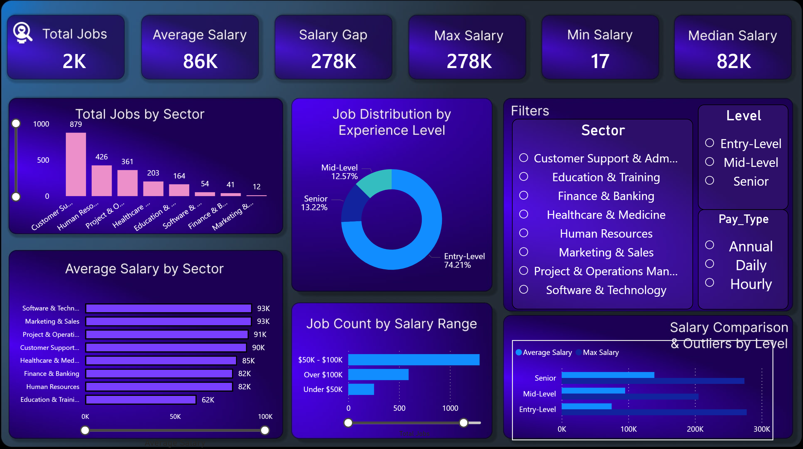

# 📊 NYC Jobs Market Analytics Dashboard

An end-to-end data analysis project exploring job market trends, salary distributions, and experience level demands across sectors in New York City.

---

## 🖥️ Dashboard Overview



---

## 💡 Key Metrics & Insights

* **Total Active Jobs:** 2,000 postings analyzed.
* **Salary Averages:** Average salary sits at **$86K**, with a median of **$82K**.
* **Experience Level Distribution:** Entry-level positions dominate the market at **74.21%**, followed by Senior (**13.22%**) and Mid-Level (**12.57%**).
* **Top Sectors:** Customer Support & Administration, Human Resources, and Project Management lead in job volume.
* **Highest Paying Sectors:** Software & Technology and Marketing & Sales lead with an average salary of **$93K**.

---

## 🛠️ Tools & Technologies

* **Python:** Data Ingestion, Data Cleaning, and Sector Classification.
* **Power BI & Figma:** Interactive Visualizations and Custom Dashboard Layout Design.
* **Pandas / NumPy:** Feature Engineering and Statistical Summaries.

---

## 📁 Repository Structure

```text
├── Data/
│   └── NYC_Jobs.csv
├── NYC_Jobs_Project/
│   ├── 01_data_ingestion.py
│   ├── 02_clean_title_and_classify_sector.py
│   ├── 03_Feature_Engineering.py
│   ├── 04_Analysis.py
│   ├── Dashboard.pbix
│   └── Report.pptx
├── dashboard.png
└── README.md